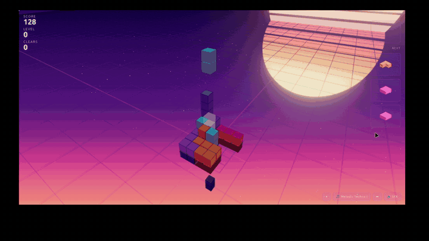

# VECTRIS — 3D Tetris

**The Tetris you grew up with, reborn in 3D.** Polycube pieces tumble down a
neon well where whole **planes _and_ columns** vanish — equal parts nostalgia
and spatial-reasoning workout. Full-stack build: **Three.js + TypeScript** front end,
**Supabase (Postgres)** backend for a real-time global leaderboard.

**▶️ [Play it live](https://vectris-3d-tetris-demo.onrender.com)** · **🎥 [Watch the demo](https://github.com/mangofillet/vectris-demo/releases/latest)**

> **What it demonstrates:** full-stack web development · TypeScript · real-time backend integration (Supabase / Postgres) · 3D graphics (Three.js / WebGL) · state management & deployment.

---

## What it is

A true **3D Tetris** (Blockout-style) that runs in the browser. Instead of flat
tetrominoes, you rotate **polycubes** in three dimensions and drop them into a
square well. Clear a full horizontal plane **or** a full vertical column to score.
It looks like an arcade cabinet and plays like a brain-teaser.

## Features

- 🧊 **True 3D play** — rotate pieces on every axis, think in depth
- ⚡ **Plane _and_ column clears** — a fresh twist on the classic rules
- 🌆 **Neon / synthwave visuals** — bloom, multiple themes, cube skins
- 🎵 **Music & SFX** — with a proper synthwave soundtrack
- 🏆 **Global leaderboard** — high scores persisted to a **Supabase (Postgres)** backend, so you compete against everyone (local best tracked too)

## Controls

Desktop / keyboard. Arrow keys and rotation keys to steer pieces; drop to lock.
(Full control map appears in-game.)

---

## Demo video

The demo is attached to the [latest release](https://github.com/mangofillet/vectris-demo/releases/latest).
Click through to watch VECTRIS in motion.

> Tip: for an inline-playing preview, drag the video into the release notes on
> GitHub's web editor — GitHub will host and embed it.

---

## About the code

The full source (Three.js renderer, TypeScript game engine, tests) lives in a
**private repository**. This repo is a public showcase — playable demo and video
only. Interested in the implementation? Reach out.

---

*Assisted by [Claude Code](https://claude.ai/code)*
